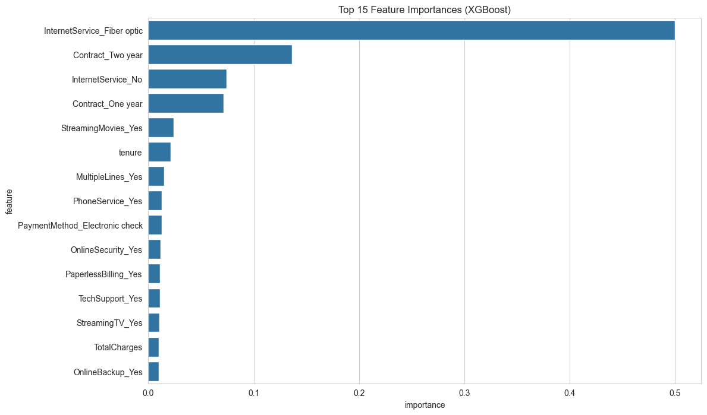

# Customer Churn Prediction for a Telecom Company

## 1. Problem Statement
This project aims to build a machine learning model that accurately predicts customer churn for a telecom company. By identifying customers at high risk of leaving, the company can proactively implement targeted retention strategies, thereby reducing revenue loss and improving customer loyalty. The key objectives are:
- Predict whether a customer will churn (Yes/No).
- Identify the key drivers and factors that contribute to customer churn.

## 2. Dataset
The dataset used is the **Telco Customer Churn** dataset from Kaggle. It contains `7,043` customer records with `21` features, including:
- **Customer Demographics**: Gender, Senior Citizen status, Partner, and Dependents.
- **Services Subscribed**: Phone, Multiple Lines, Internet, Online Security, etc.
- **Account Information**: Tenure, Contract type, Payment Method, Monthly Charges, and Total Charges.
- **Target Variable**: `Churn` (Yes/No).

## 3. Project Workflow
The project followed a standard data science methodology:

1.  **Data Cleaning**: Handled missing values in `TotalCharges` by converting the column to numeric and imputing with the median. Converted the `Churn` column to a binary format (1/0).
2.  **Exploratory Data Analysis (EDA)**: Visualized churn rates across different features like contract type, tenure, and payment methods. A correlation heatmap was used to understand relationships between numeric features.
    * **Key Insight**: Customers on a `Month-to-month` contract churn at a significantly higher rate than those on yearly contracts.
3.  **Feature Preprocessing**: Applied `StandardScaler` to numerical features and `OneHotEncoder` to categorical features using a `Pipeline` to prevent data leakage.
4.  **Modeling**: Trained and evaluated three different models:
    - Logistic Regression (as a baseline)
    - Random Forest
    - XGBoost
5.  **Evaluation**: Models were evaluated using Accuracy, Precision, Recall, F1-Score, and ROC-AUC. XGBoost was selected as the final model due to its superior performance.

## 4. Results
The final XGBoost model achieved the following performance on the test set:
- **Accuracy**: ~80%
- **ROC-AUC Score**: ~0.84

The top factors influencing customer churn were identified as:
- **Contract Type**: `Month-to-month` contracts are the single biggest predictor of churn.
- **Tenure**: Customers with shorter tenure are more likely to leave.
- **Monthly Charges**: Higher monthly charges are correlated with higher churn rates.

 
## 5. Deployment
A simple web application was built using **Streamlit** to serve the model. The app allows a user to input customer details and receive a real-time churn probability prediction.


## 6. How to Run
1.  Clone the repository:
    ```bash
    git clone [https://github.com/your-username/churn_prediction.git](https://github.com/your-username/churn_prediction.git)
    cd churn_prediction
    ```
2.  Create a virtual environment and install dependencies:
    ```bash
    python -m venv venv
    source venv/bin/activate  # On Windows: venv\Scripts\activate
    pip install -r requirements.txt
    ```
3.  To run the analysis notebook:
    ```bash
    jupyter notebook churn_analysis.ipynb
    ```
4.  To run the Streamlit web app:
    ```bash
    streamlit run app.py
    ```
    